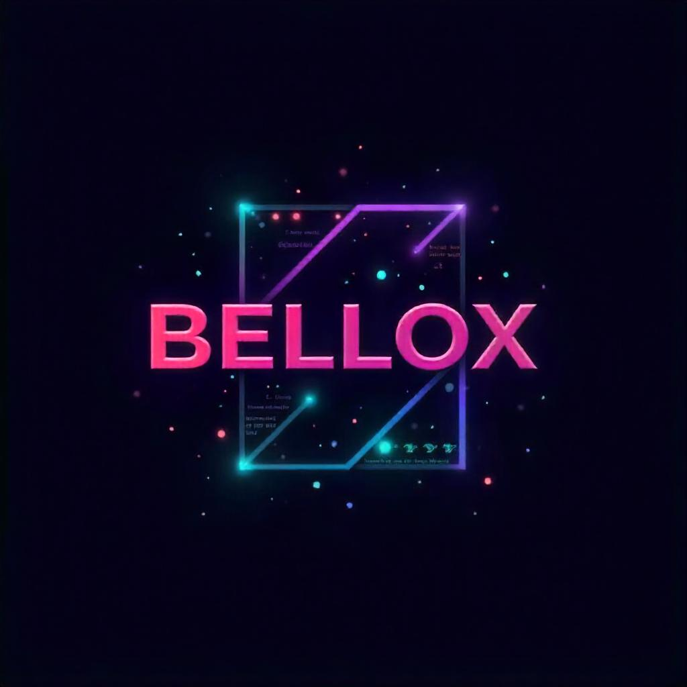

# 🔍 AnimeRech - Explorateur d'Anime & Lecteur de Manga

<p align="center">
  
</p>

Une plateforme web moderne et intuitive pour explorer l'univers des animes et mangas. Propulsée par **Vanilla JavaScript**, elle offre une expérience de recherche fluide grâce à l'API Jikan et propose un lecteur de manga intégré pour une immersion totale.

---

## ✨ Fonctionnalités Principales

### 🎯 Exploration & Recherche
*   **Moteur de recherche intelligent** : Accédez instantanément à des milliers de titres via la base de données MyAnimeList.
*   **Filtres de résultats** : Personnalisez l'affichage avec un nombre de résultats ajustable (5 à 20).
*   **Découverte Aléatoire** : Trouvez votre prochaine pépite grâce au bouton "Aléatoire".
*   **Top Animes** : Une sélection des séries les plus populaires affichée dynamiquement sur la page d'accueil.

### 📖 Lecture & Informations
*   **Lecteur de Manga** : Une interface dédiée pour lire vos chapitres de manga préférés directement sur le site.
*   **Détails Complets** : Accédez aux synopsis (traduits en français), scores, nombres d'épisodes et bandes-annonces.
*   **Contenus Additionnels** : Sections dédiées pour des cours ou ressources liées à l'univers manga.

### 📱 Interface & Design
*   **Design Premium** : Une esthétique soignée avec des animations fluides et un mode sombre élégant.
*   **Entièrement Responsive** : Une expérience optimisée de la même manière sur mobile, tablette et desktop.
*   **Navigation Intuitive** : Sidebar rétractable pour un accès rapide aux différentes pages (Accueil, À propos, Aide, Contact).

---

## 🛠️ Stack Technique

*   **Langage** : JavaScript (ES6+)
*   **Structure** : HTML5 (Sémantique)
*   **Stylisation** : CSS3 (Animations, Flexbox, Grid)
*   **APIs & Bibliothèques** :
    *   **Jikan API v4** (Données MyAnimeList)
    *   **Google Translation API** (Traduction intelligente)
    *   **Font Awesome 6** (Iconographie)
*   **Police** : Montserrat (via Google Fonts)

---

## 🚀 Installation et Lancement

Projet statique sans dépendances côté serveur.

### 1. Clonage
```bash
git clone https://github.com/Bellox1/animeRech.git
cd animeRech
```

### 2. Utilisation
Exécutez le fichier `index.html` dans n'importe quel navigateur web moderne. L'utilisation d'un serveur local type "Live Server" est recommandée pour assurer le bon fonctionnement des appels aux APIs.

---

## 📄 Licence

Ce projet est sous licence MIT. Développé par **BELLOX**.
